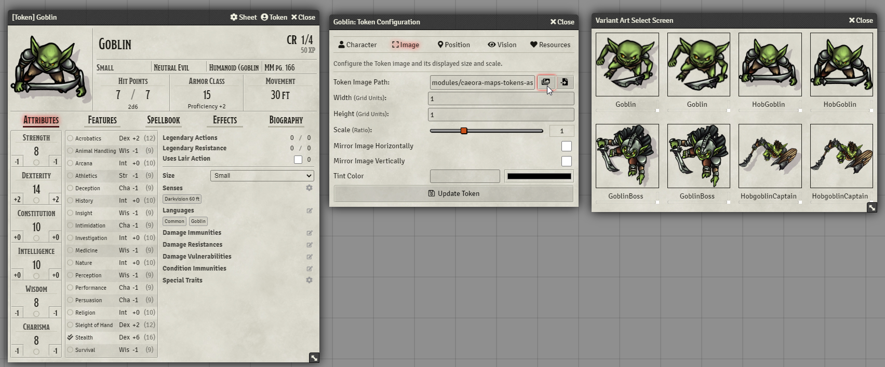
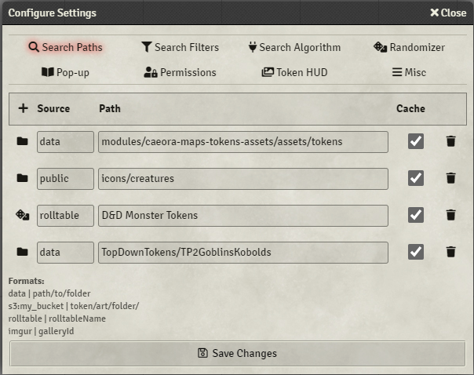
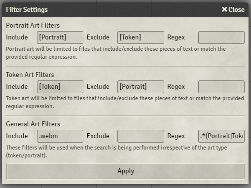
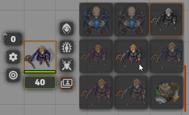
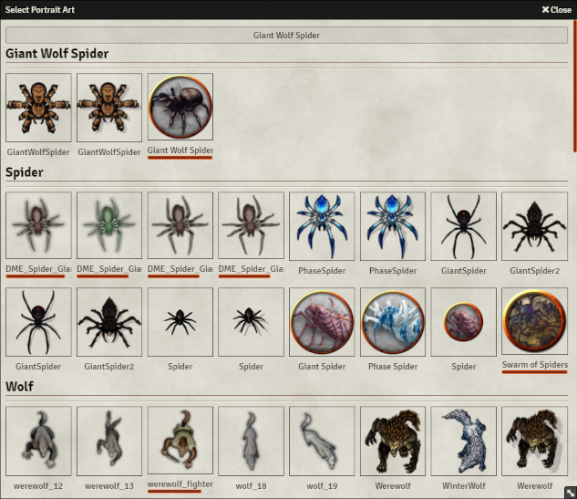
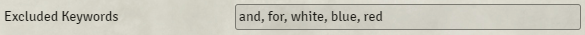

# Token Variant Art

This module provides a pop-up window upon token creation which displays all the available variants of the token art it could find in the customizable list of directories.

The search is done using the Actor's name, and will ignore special characters, case, or spaces in the files

e.g.

- '**Mage**' will match: **09_mage.png**, **red-MAGE-64.png**, **mage-s_fire.jpg**
- '**Half-Red Dragon Veteran**' will match: **HalfRedDragonVeteran.png**, **hAlF_rEd_dRAgon-VETERAN.png**

The only requirement is that the full name of the Actor is present in the file name. So the following would not match:

- '**Mage**' will NOT match: **mag03.png**, **09_ma_abc_ge.png**
- '**Half-Red Dragon Veteran**' will NOT match **RedDragon.png**, **HalfRedDragon.png**

The 'Art Select' screen can also be opened up from the Actor Sheet by right-clicking on the portrait or the 'Token Configuration' window's 'Image' tab. A new button is added right next to the File Picker:

## Settings
### Variant art search paths

The directories that will be scanned for art can be set here. All of the sub-directories will be searched as well so feel free to organise your art as you wish.

The root of these paths is assumed to be Foundry VTT's local Data folder. The same folder where you would find your worlds, systems, and modules.

By default 'Token Variants' will attempt to search [Caeora's Maps, Tokens, and Assets](https://foundryvtt.com/packages/caeora-maps-tokens-assets) asset folder if installed.

To specify a path for a [configured](https://foundryvtt.com/article/aws-s3/) AWS S3 bucket you can use the following format:

**s3:{bucket-name}:{path}**

### Filter Settings

There are 3 types of searches. Portrait, Token, and General (Token+Portrait). Each of these searches can be configured with filters to exclude files that include or exclude certain text, or match some regular expression.

### Token HUD Settings

A SubMenu with the following settings:

#### Enable Token HUD Button
Enables extra button in the Token HUD which brings up all of the found art in a small preview to the right: 

This art can be shared with players by right-clicking on the images, which makes them available in the Token HUD side menu without the need to enable the **Enable Token HUD button for everyone** setting. Shared artwork is indicated by a green arrow.

#### Display as image?

Controls whether the art in the preview is rendered as images or file names.

#### Opacity of token preview

Controls the opacity of the tokens in the preview before being hovered over.

### Enable Token HUD button for everyone

If checked will allow all players to access the new Token HUD button.
### Disable Caching

By default the module will search the directories defined in 'Variant art search paths' only when the world is loaded or when the module settings have changed. If new art is added while the world is still open it will not be found by the module. 'Disable Caching' will force the search to be performed every time a new actor is created at a significant cost to speed at which the art is displayed to the user.

### Disable Automatic Popups

If checked will prevent automatic popups from being triggered upon Actor creation. The popup can still be brought up if Ctrl key is held while dragging the Token/Actor.

### Filter by D&D 5e Monster (SRD)

Can be enabled if you want variant art to not be retrieved for actors with names not found in D&D 5e Monster (SRD) list.

### Search by Keyword

When enabled the art search will be done using both the Actor/Token full name as well as individual words within the name:

### Excluded Keywords

Words within this list will be excluded from the keywords search:

### Actor Directory Popup key

Controls the key used to trigger a popup when dragging an actor from the 'Actor Directory'.

### Display separate pop-ups for Portrait and Token art

When enabled the Art Select pop-up will be shown twice upon actor/token creation. Once for the portrait, and then again for the token art.

## Installation
To install, import this [manifest](https://raw.githubusercontent.com/Aedif/TokenVariants/master/module.json) into the module browser or search for 'Token Variant Art'.
