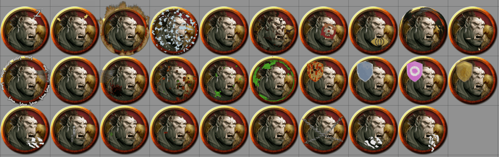
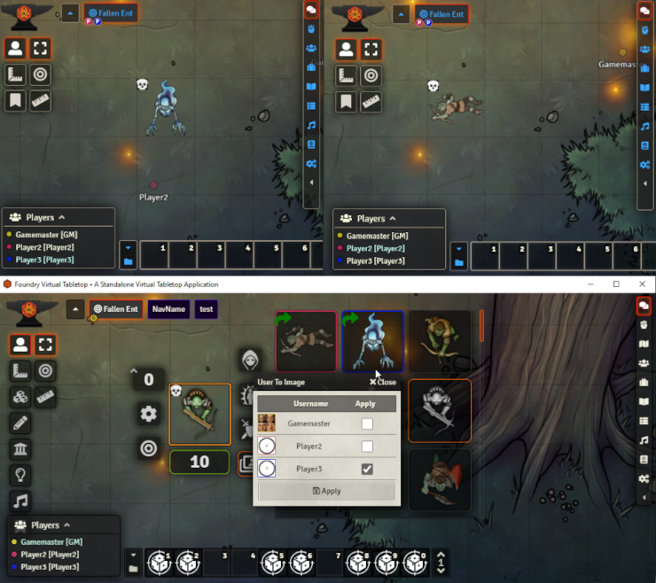
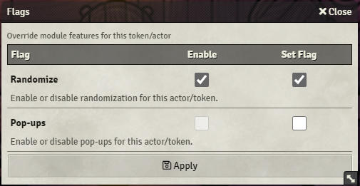
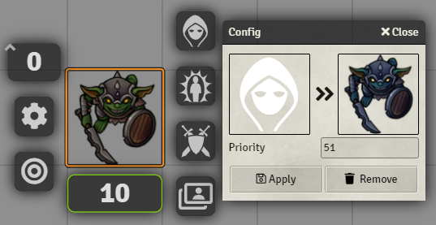

# Token Variant Art

Improve management of Token art in-session and during prep.

This module searches a customisable list of directories and makes found art available through vairous convenient means such as pop-ups and a new Token HUD button.

Main features include:

- Sourcing images from local folders, rolltables, Imgur galleries, and s3 buckets
- Pop-ups on Actor/Token create to select images found based on Actor/Token name
- Overlaying images/videos on top or bellow the token
- Sharing specific art with players through the Token HUD allowing them to switch out their token art on the fly
- Displaying different images for the same token for each user
- Image filtering based on identifiers e.g. when selecting a portrait only showing images containing 'PRT': Bob[PRT].png, Tom[PRT].png
- Wildcard images shown in the Token HUD
- Aided and/or automatic mapping of images to actor compendiums
- Assigning art to status effects and Visibility/Combat states, updating tokens once conditions such as 'Dead' and 'Paralysis' have been applied
- Assigning custom token configuration (token scale, vision, name etc.) to images which are applied upon image selection through the Token HUD

For the comprehensive list of settings and features checkout the module's [wiki](https://github.com/Aedif/TokenVariants/wiki).

You can support me on [Patreon](https://www.patreon.com/Aedif). In addition to helping me to continue working on FoundryVTT modules you will be granted access to a selection of pre-configured animated overlays to be used along with this module:

Watch a short feature showcase on YouTube:

## Image to User mappings

Images displayed in the Token HUD can be Shift-Right clicked to open a window that allows you to map an image to be displayed to a specific user.

## Pop-up and Randomizer override

By Shift+Left-clicking the Token HUD button you are able to override certain module features for the specific token/actor.

### Status Config

Allows to map images to Visibility/Combat status and Active Effects.

The window is accessed by Shift+Left-Clicking on the status buttons or the Active Effects in the Token HUD.

## Installation

To install, import this [manifest](https://raw.githubusercontent.com/Aedif/TokenVariants/master/module.json) into the module browser or search for 'Token Variant Art'.
