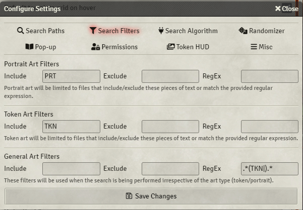
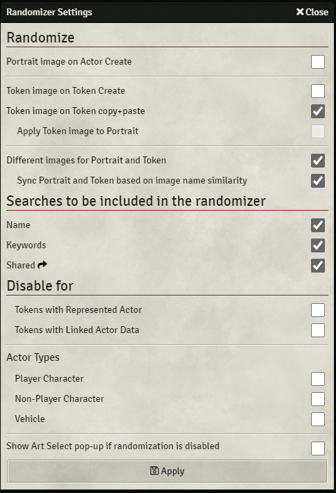
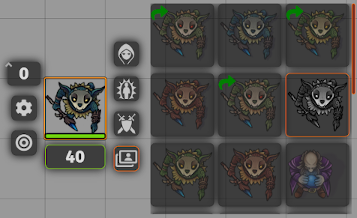
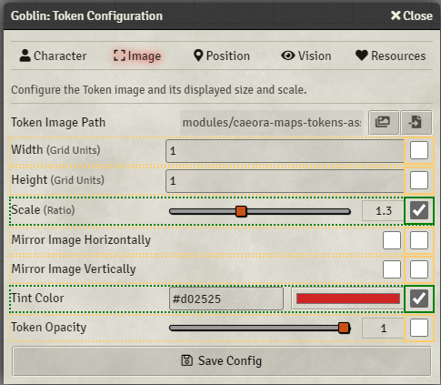

# Token Variant Art

Improve management of Token art in-session and during prep.

This module searches a customisable list of directories and makes found art available through vairous convenient means such as pop-ups and a new Token HUD button.

Main features include:

- Sourcing images from local folders, rolltables, Imgur galleries, and s3 buckets
- Pop-ups on Actor/Token create to select images found based on Actor/Token name
- Sharing specific art with players through the Token HUD allowing them to switch out their token art on the fly
- Image filtering based on identifiers e.g. when selecting a portrait only showing images containg 'PRT': Bob[PRT].png, Tom[PRT].png
- Wildcard images shown in the Token HUD
- Aided and/or automatic mapping of images to actor compendiums
- Assigning art to status effects and Visibility/Combat states, updating tokens once conditions such as 'Dead' and 'Paralysis' have been applied
- Assigning custom token configuration (token scale, vision, name etc.) to images which are applied upon image selection through the Token HUD

The comprehensive list of settings is available bellow.

https://user-images.githubusercontent.com/7693704/121926941-69aff780-cd36-11eb-864b-b2a9640baeea.mp4

The image searches are done using the Actor's or Token's name, and will ignore special characters, case, or spaces in the files

e.g.

- '**Mage**' will match: **09_mage.png**, **red-MAGE-64.png**, **mage-s_fire.jpg**
- '**Half-Red Dragon Veteran**' will match: **HalfRedDragonVeteran.png**, **hAlF_rEd_dRAgon-VETERAN.png**

## Settings

### Search Paths

The directories that will be scanned for art can be set here. All of the sub-directories will be searched as well so feel free to organise your art as you wish.

The root of these paths is assumed to be Foundry VTT's local Data folder. The same folder where you would find your worlds, systems, and modules.

By default 'Token Variants' will attempt to search [Caeora's Maps, Tokens, and Assets](https://foundryvtt.com/packages/caeora-maps-tokens-assets) asset folder if installed.

In addition to local paths you can also add s3 buckets, ForgeVTT asset folders, and Rolltables as image sources:

- To specify a path for a [configured](https://foundryvtt.com/article/aws-s3/) AWS S3 bucket use the following format: **s3:{bucket-name}:{path}**
- Rolltables can be added using: **rolltable:{rolltable name}**
- For your ForgeVTT asset library the format is as follows: **forgevtt:{path}**
  - This is far slower than using API keys and **Forge Asset Library Paths** setting.
- Imgur galleries can be linked with: **imgur:galleryID**
  - e.g. https://imgur.com/gallery/ **JweWCpf** -> imgur:**JweWCpf**
  - Imgur paths can be automatically converted to RollTables
  - **!!!** Imgur galleries cannot be accessed when running Foundry on 'localhost'.

By default the module will scan these sources only when the world is loaded or when the **Search Paths** settings have changed. If new art is added while the world is still open it will not be found by the module. Disabling '**Cache**' will force the scan to be done every time an art search is performed at a potentially significant cost to speed at which the art is displayed to the user depending on the number of images.

For small directories and rolltables the performance hit is negligible so experiment with the convenience/performance trade-offs until you find the right balance.

### Forge Asset Library Paths

This setting will only be available when running the game through Forge VTT and can be configured by both GMs and regular players. Paths entered here point to locations within each users Asset Library and will be private to that user unless an API Key is entered and paths explicitly indicated to be shared.

### Search Filter Settings

_Example image setup for files labelled as so: Dragon_PRT.png, Dragon_TKN.png_

There are 3 types of searches. Portrait, Token, and General (Token+Portrait). Each of these searches can be configured with filters to exclude files that include or exclude certain text, or match some regular expression.

### Search Algorithm Settings

Allows to change the search algorithm used by the module. By default the module will only return images that fully contain the Token/Actor name (exact search), but you can also enable approximate searches (fuzzy search) and configure the acceptable percentage match.

### Randomizer Settings

If enabled will automatically assign random images to Actor portraits and Tokens. The images will be chosen from searches performed using the actor/token name and/or keywords. Additionally you may also include images shared through the TokenHUD side menu.

### Pop-up Settings

#### Disable separate pop-ups for Portrait and Token art

When enabled two separate pop-ups will be displayed upon Actor/Token creation, first to select the portrait art and second to select the Token art.

#### Disable prompt between Portrait and Token art select

Will disable the confirmation prompt displayed when the **Disable separate pop-ups for Portrait and Token art** is enabled. Two pop-ups will always be shown.

#### Disable Automatic Pop-ups

Automatic pop-ups can be disabled for type of actor (PC, NPC, Vehicle) and the type of event (Actor Create, Token Create, Token Copy+Paste).

### Token HUD Settings

#### Enable Token HUD Button

Enables extra button in the Token HUD which brings up all of the found art in a small preview to the right:

This art can be shared with players by right-clicking on the images, which makes them available in the Token HUD side menu without the need to enable the **Enable Token HUD button for everyone** setting. Shared artwork is indicated by a green arrow.

By default the side menu uses the token's name as the search criteria. However a custom search can be performed by right-clicking on the new Token HUD button while the side menu is open:

#### Always show HUD Button

If enabled the HUD Button will be shown even when no matches have been found.

#### Display as image

Controls whether the art in the preview is rendered as images or a list of file names.

#### Opacity of token preview

Controls the opacity of the tokens in the preview before being hovered over.

#### Update Actor portrait

When enabled selecting an image from the Token HUD will also apply it to the character sheet.

#### Include wildcard images

'Alternate Actor Tokens' will be included in the HUD.

#### Enable Token HUD button for everyone

Makes the HUD button available for all players.

#### Display only shared images

Limits images shown in the Token HUD just to the shared (Rich-clicked).

#### Include keywords in the search

By default Token HUD only shows full name matched images. This will include keyword matches as well.

### Search by Keyword

When enabled the art search will be done using both the Actor/Token full name as well as individual words within the name:

### Excluded Keywords

Words within this list will be excluded from the keywords search. By default "and,for" are ignored in token/actor names.

### Actor Directory Popup key

Controls the key used to trigger a pop-up when dragging in an actor from the 'Actor Directory'.

### Match name to folder

When enabled all searches will be done both on the file names as well as the file path:

e.g. '**Dragon**' will match "token_art/**dragon**s/red/avatar.png" as well as "tokens/monsters/Red**Dragon**.png"

## Image configuration

Images displayed in the **Art Select** window or the **TokenHUD** side menu can be shift+left-clicked to open a configuration pop-up:

Once configured these settings will be applied to the token every time you switch to these images using the **Token Variant Art** module.

## Enable Status Config

Allows to map images to Visibility/Combat status and Active Effects.

The window is accessed by Shift+Left-Clicking on the status buttons or the Active Effects in the Token HUD.

## Compendium Mapper

Auto-updates or queues up 'Art Select' window for all Actors within a Compendium.

## Permissions

Allows to enable and disable module features based on the user's role.

## Installation

To install, import this [manifest](https://raw.githubusercontent.com/Aedif/TokenVariants/master/module.json) into the module browser or search for 'Token Variant Art'.

## API

### **showArtSelect(search, \{callback = null, searchType='both', tokenConfig=\{\}\}=\{\})**

Displays the art select window.

Parameters:

- **\{string\}** **search** The text to be used as the search criteria
- **\{object\}** Options which customize the search

  - \{Function[]\} [callback] Function to be called with the user selected image path
  - \{SEARCH_TYPE|string\} [searchType] (token|portrait|both) Controls filters applied to the search results
  - \{Token|object\} [tokenConfig] Used to source default token image config from such as (width, height, scale, etc.)
  - \{boolean\} [options.force] If true will always override the current Art Select window if one exists instead of adding it to the queue
  - \{boolean\} [options.ignoreKeywords] Override for the 'Search by Keyword' setting
  - \{object\} [options.algorithmOptions] Override for the 'Search Algorithm Settings' setting
  - \{boolean\} [options.algorithmOptions.exact] Force use exact search
  - \{boolean\} [options.algorithmOptions.fuzzy] Force use fuzzy search
  - \{number\} [options.algorithmOptions.fuzzyLimit] Force fuzzy search image return limit
  - \{number\} [options.algorithmOptions.fuzzyThreshold] Force fuzzy search threshold (0.0-1.0)
    e.g.

- game.modules.get('token-variants').api.showArtSelect("")
- game.modules.get('token-variants').api.showArtSelect("dragon", \{callback: (selectedImg) => console.log(selectedImg)\})

### **doImageSearch(search, \{searchType = 'both', ignoreKeywords = false, simpleResults = false, callback = null\}=\{\})**

Performs an image search and returns the results.

Parameters:

- **\{string\}** **search**: Text to be used as the search criteria
- **\{object\}** Options which customize the search
  - \{SEARCH_TYPE|string\} [options.searchType] (token|portrait|both) Controls filters applied to the search results
  - \{Boolean\} [options.ignoreKeywords] Ignores keywords search setting
  - \{Boolean\} [options.simpleResults] Results will be returned as an array of all image paths found
  - \{Boolean\} [options.callback] Function to be called with the found images
  - \{object\} [options.algorithmOptions] See showArtSelect(...)
- **returns**: \{Promise<Map<string, Array<object>|Array<string>>\} Images found

e.g.

- game.modules.get('token-variants').api.doImageSearch("Dragon")
- game.modules.get('token-variants').api.doImageSearch("Dragon", {simpleResults: true})

### **doRandomSearch(search, \{ searchType='both', actor=null, callback=null \} = \{\})**

Performs a random image search and returns the results.

Parameters:

- **\{string\}** **search**: Text to be used as the search criteria
- **\{object\}** Options which customize the search
  - \{SEARCH_TYPE|string\} [options.searchType] (token|portrait|both) Controls filters applied to the search results
  - \{Actor\} [options.actor] Used to retrieve 'shared' images from if enabled in the Randomizer Settings
  - \{Function[]\} [options.callback] Function to be called with the random image
- **returns**: \{Array<string>|null\} Image path and name

e.g.

- game.modules.get('token-variants').api.doRandomSearch("Goblin")
- game.modules.get('token-variants').api.doRandomSearch("Goblin", \{callback: (result) => console.log(result)\})

### **updateTokenImage(imgSrc, \{token = null, actor = null, imgName = null\} = \{\})**

Updates token image applying custom configuration if one exists.

- **\{string\}** **imgSrc**: Image source path/url
- **\{object\}** Update options
  - \{Token\} [token] Token to be updated with the new image
  - \{Actor\} [actor] Actor with Proto Token to be updated with the new image
  - \{string\} [imgName] Image name if it differs from the file name. Relevant for rolltable sourced images.

e.g.

- game.modules.get('token-variants').api.updateTokenImage("tokenImages/dragon/RedDragon.jpg", {token: canvas.tokens.controlled[0]});

## **cacheTokens()**

When called will trigger the refresh of the token cache.
